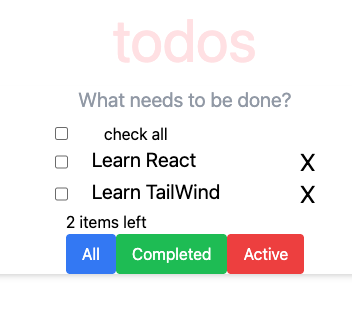
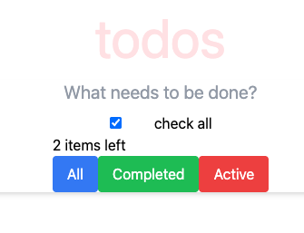
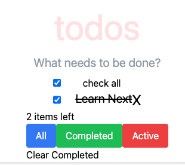
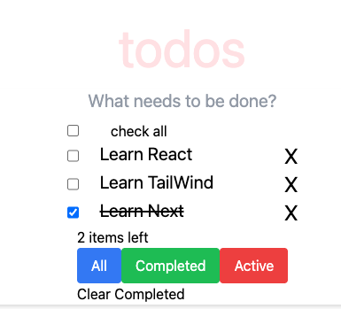

# ✅ Todo App

A simple and intuitive Todo List application built with **Next.js** and **Tailwind CSS**. Users can:

- Add todos
- Mark todos as completed
- Delete individual todos
- Check/uncheck all todos at once
- Filter by All / Active / Completed
- Clear all completed todos

## 🔧 Tech Stack

- **React** with Next.js
- **Tailwind CSS** for styling
- **UUID** for unique identifiers

## 📸 Screenshots

### Add and List Tasks

### Mark All as Completed

### Filter by Completed

### Filter by Active

## 📁 Folder Structure